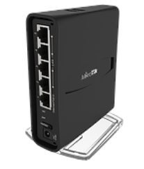

# Mikrotik hAP ac² Profiles

## Idea

This repository contains some useful configurations for the Mikrotik hAP ac² I
use from time to time for testing purposes.

Please adjust the configuration to your needs and also **change the
credentials** for the admin interface and WiFi networks.

## Product Information

The Mikrotik hAP ac² router has 5 Gigabit Ethernet ports, one with PoE, Wi-Fi
and USB for 3G/4G support.

Technical details from the
[datasheet](https://cdn.mikrotik.com/web-assets/product_files/hAP_ac_2_tower_220152.pdf):

| Description  | Configuration                                                       |
| ------------ | ------------------------------------------------------------------- |
| Product Name | Mikrotik hAP ac²                                                    |
| Product Page | https://mikrotik.com/product/hap_ac2                                |
| Architecture | 32 bit ARM                                                          |
| OS           | RouterOS (https://wiki.mikrotik.com/wiki/Manual:TOC)                |
| RAM          | 128 MB                                                              |
| Storage      | 16 MB Flash                                                         |
| Ethernet     | 5 x 10/100/1000 Mbps ports                                          |
| Wireless     | 2.4 GHz (300 Mbps), 802.11b/g/n 5 GHz (867 Mbps), 802.11a/n/ac |
| USB          | 1 port, can be used for tethering                                   |
| Power        | 12-28 V input, max. 21 W                                            |

Image (source: https://mikrotik.com/product/hap_ac2#fndtn-gallery):



## Usage

### Reset

Reset the RouterOS configuration:

1. Unplug the device from power
2. Press and hold the button right after applying power
3. Hold the button until LED will start flashing
4. Release the button to clear configuration

### Connect

Connect your Ethernet port (e.g. `eth0`) to the port `2` of the router.

Get a network configuration either via your network management software or manually:

```
$ sudo ip link set dev eth0 up
$ sudo dhclient -v eth0
```

### Upload Profile

Take the profile you want, modify it to your needs (IP addresses, credentials,
Wi-Fi name, ...).

> ⚠️ Always make sure to change the credentials for the Wi-Fi and management interface!

Upload the profile to the router via FTP:

```
$ curl -T wifi-nat-router ftp://admin:@192.168.88.1/flash/myconfig.rsc
  % Total    % Received % Xferd  Average Speed   Time    Time     Time  Current
                                 Dload  Upload   Total   Spent    Left  Speed
100  5376    0     0  100  5376      0  86709 --:--:-- --:--:-- --:--:-- 88131
```

### Apply Profile

Connect to the router on `192.168.88.1` and login using the default credentials
(username `admin` / empty password):

```
$ telnet 192.168.88.1
Trying 192.168.88.1...
Connected to 192.168.88.1.
Escape character is '^]'.

MikroTik v6.45.8 (long-term)
Login: admin
Password: 

[...]
```

Perform a reset and apply the configuration:

```
[admin@MikroTik] > /system reset-configuration run-after-reset=flash/myconfig.rsc 
Dangerous! Reset anyway? [y/N]: 
y
system configuration will be reset
Connection closed by foreign host.
```

The router will reboot and the configuration will be applied. Enjoy.

## Profiles

### Ethernet Switch

A simple Ethernet switch.

| Description                  | Configuration                                        |
| ---------------------------- | ---------------------------------------------------- |
| Profile Name                 | `ethernet-switch`                                    |
| File                         | [ethernet-switch](profiles/ethernet-switch)          |
| Hostname                     | `myrouter`                                           |
| Management                   | `10.5.23.1/24` on all ports                          |
| Credentials                  | `admin:password`                                     |
| Mode                         | Bridge                                               |
| Wireless                     | Disabled                                             |
| Local Network (all ports)    | Switching                                            |

### WiFi Ethernet Switch

A simple Ethernet switch and also a Wi-Fi access point to access the same network.

| Description                  | Configuration                                           |
| ---------------------------- | ------------------------------------------------------- |
| Profile Name                 | `wifi-ethernet-switch`                                  |
| File                         | [wifi-ethernet-switch](profiles/wifi-ethernet-switch)   |
| Hostname                     | `myrouter`                                              |
| Management                   | `10.5.23.1/24` on all ports and Wi-Fi                   |
| Credentials                  | `admin:password`                                        |
| Mode                         | Bridge                                                  |
| Wireless                     | Enabled                                                 |
| SSID                         | `mywifi`                                                |
| Wi-Fi Password               | `wifipassword`                                          |
| Wi-Fi Security               | WPA2, AES/CCM                                           |
| Local Network (all ports)    | Switching                                               |

### NAT Router

A router with one WAN port for the uplink and the other ports for the clients.

| Description                  | Configuration                                                        |
| ---------------------------- | -------------------------------------------------------------------- |
| Profile Name                 | `nat-router`                                                         |
| File                         | [nat-router](profiles/nat-router)                                    |
| Hostname                     | `myrouter`                                                           |
| Management                   | `10.5.23.1/24` on ports `2`-`5`                                      |
| Credentials                  | `admin:password`                                                     |
| Mode                         | Router                                                               |
| Wireless                     | Disabled                                                             |
| WAN/Uplink (port `1`)        | DHCP client for uplink connection, MAC Address: `48:8F:5A:11:22:33`  |
| Local Network (port `2`-`5`) | DHCP server for client connections, Pool: `10.5.23.50-100`           |

### WiFi NAT Router

A router with one WAN port for the uplink and the other ports and Wi-Fi for the clients.

| Description                            | Configuration                                                        |
| ---------------------------------      | -------------------------------------------------------------------- |
| Profile Name                           | `wifi-nat-router`                                                    |
| File                                   | [wifi-nat-router](profiles/wifi-nat-router)                          |
| Hostname                               | `myrouter`                                                           |
| Management                             | `10.5.23.1/24` on ports `2`-`5`                                      |
| Credentials                            | `admin:password`                                                     |
| Mode                                   | Router                                                               |
| Wireless                               | Enabled                                                              |
| SSID                                   | `mywifi`                                                             |
| Wi-Fi Password                         | `wifipassword`                                                       |
| Wi-Fi Security                         | WPA2, AES/CCM                                                        |
| WAN/Uplink (port `1`)                  | DHCP client for uplink connection, MAC Address: `48:8F:5A:11:22:33`  |
| Local Network (port `2`-`5` and Wi-Fi) | DHCP server for client connections, Pool: `10.5.23.50-100`           |

### LTE NAT Router

A router using the mobile phone connected via USB for the uplink and the ethernet ports for the clients.

| Description                  | Configuration                                        |
| ---------------------------- | ---------------------------------------------------- |
| Profile Name                 | `lte-nat-router`                                     |
| File                         | [lte-nat-router](profiles/lte-nat-router)            |
| Hostname                     | `myrouter`                                           |
| Management                   | `10.5.23.1/24` on all ports                          |
| Credentials                  | `admin:password`                                     |
| Mode                         | Router                                               |
| USB                          | Connect mobile phone via USB. Router performs DHCP.  |
| Wireless                     | Disabled                                             |
| Local Network (all ports)    | DHCP server for clients, Pool: `10.5.23.50-100`      |

### LTE WiFi NAT Router

A router using the mobile phone connected via USB for the uplink and the ethernet ports and Wi-Fi for the clients.

| Description                  | Configuration                                        |
| ---------------------------- | ---------------------------------------------------- |
| Profile Name                 | `lte-wifi-nat-router`                                |
| File                         | [lte-wifi-nat-router](profiles/lte-wifi-nat-router)  |
| Hostname                     | `myrouter`                                           |
| Management                   | `10.5.23.1/24` on all ports                          |
| Credentials                  | `admin:password`                                     |
| Mode                         | Router                                               |
| USB                          | Connect mobile phone via USB. Router performs DHCP.  |
| Wireless                     | Enabled                                              |
| SSID                         | `mywifi`                                             |
| Wi-Fi Password               | `wifipassword`                                       |
| Wi-Fi Security               | WPA2, AES/CCM                                        |
| Local Network (all ports)    | DHCP server for clients, Pool: `10.5.23.50-100`      |

## Other Configurations

Export configuration:

```
[admin@myrouter] > export compact terse
```

Mirror `ether2` interface to `ether5` interface:

```
 [admin@myrouter] > /interface ethernet switch set numbers=0 mirror-source=ether2 mirror-target=ether5
```
